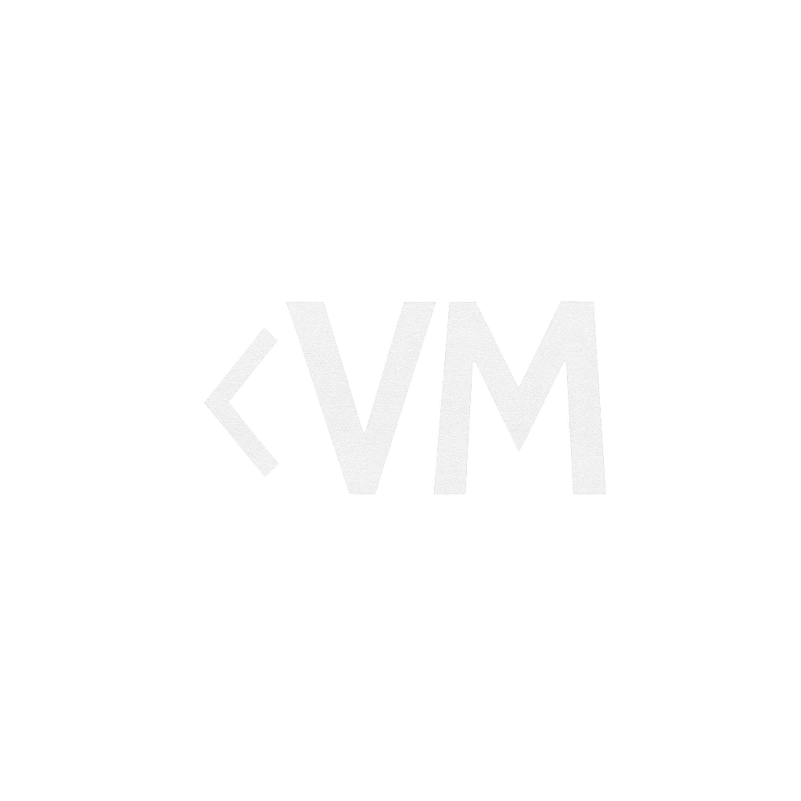

  
  <h2>
    <em>Portafolio de Víctor Martínez</em> – Desarrollador Web Frontend
  </h2>
  

    Portafolio personal y CV web utilizando Astro y TailwindCSS.
  

  

    Optimizado para rendimiento, accesibilidad y SEO técnico.
  

  <a href="#-sitio-en-vivo">
    Sitio en Vivo
  </a>
  &nbsp;✦&nbsp;
  <a href="#-tecnologías-y-herramientas">
    Tecnologías
  </a>
  &nbsp;✦&nbsp;
  <a href="#-proyectos-destacados">
    Proyectos
  </a>
  &nbsp;✦&nbsp;
  <a href="#-contacto">
    Contacto
  </a>

---

## 🌐 Sitio en Vivo

🔗 [https://vicma.vercel.app](https://vicma.vercel.app)

---

## 🚀 Tecnologías y Herramientas

**Frontend:**
- HTML5
- CSS3
- JavaScript
- TypeScript
- React
- Astro
- TailwindCSS
- Next.js

**Backend:**
- Node.js
- MySQL

**Herramientas:**
- Git & GitHub
- Vercel

**Optimización:**
- SEO técnico
- Rendimiento web
- Diseño responsivo

---

## 🛠️ Proyectos Destacados

### ✂️ Barbería Don Perfecto

- **Descripción:** Desarrollo de una landing page personalizada para una barbería local, enfocada en mejorar la captación de clientes y la experiencia de usuario móvil.
- **Características:**
  - Integración de WhatsApp Business
  - Sistema de descuentos dinámicos
  - Diseño moderno adaptado a la marca

### ✂️ EL Templo Barbería

- **Descripción:** Creación de una landing page moderna y responsiva para una barbería en Puebla.
- **Características:**
  - Optimización de carga en Lighthouse
  - Enlace directo a WhatsApp Business
  - Integración de mapa de ubicación

### 🧪 Diabetes Prediction App (ML Project)

- **Descripción:** Desarrollo de una aplicación en Streamlit para la predicción de diabetes basada en Machine Learning.
- **Características:**
  - Implementación de modelos Random Forest y XGBoost
  - Optimización de hiperparámetros
  - Despliegue de app funcional

---

## 📈 Estadísticas de GitHub

---

## 📫 Contacto

- 📧 **Correo:** [vicma.dev@hotmail.com](mailto:vicma.dev@hotmail.com)
- 💼 **LinkedIn:** [https://www.linkedin.com/in/v1cma/](https://www.linkedin.com/in/v1cma/)
- 💻 **GitHub:** [https://github.com/V1CMA-V](https://github.com/V1CMA-V)
